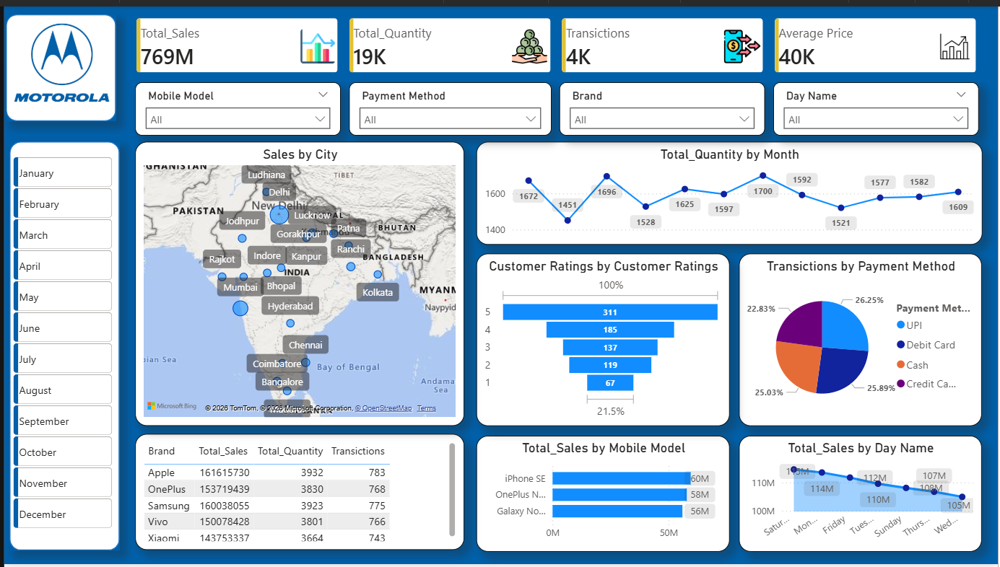

# 📊 Mobile Sales Analysis Dashboard (Power BI)

## 🔍 Project Overview
This project is an interactive **Power BI dashboard** designed to analyze mobile phone sales data using real-world business KPIs.  
It helps decision-makers track sales performance, customer behavior, and payment trends across different cities and brands.

---

## 🎯 Key KPIs
- **Total Sales:** 769M  
- **Total Quantity Sold:** 19K  
- **Total Transactions:** 4K  
- **Average Price:** 40K  

---

## 🧩 Dashboard Features
- Dynamic slicers for:
  - Brand
  - Mobile Model
  - Payment Method
  - Day Name
  - Month
- City-wise sales visualization using map
- Monthly total quantity trend
- Sales analysis by:
  - Brand
  - Mobile Model
  - Day of the Week
- Transactions split by payment method
- Customer rating distribution

---

## 📈 Business Insights
- Premium brands contribute the highest revenue
- Digital payment methods (UPI & cards) dominate transactions
- Sales volume varies significantly by day of the week
- Metro cities generate the majority of total sales
- Higher customer ratings correlate with better sales performance

---

## 🛠 Tools & Technologies Used
- Power BI Desktop  
- DAX (Measures & Calculations)  
- Data Modeling  
- Data Cleaning

## 📸 Dashboard Preview

---

## 📂 Files in this Repository
- `Mobile_Sales_Dashboard.pbix` – Power BI dashboard file  
- `dashboard_overview.png` – Dashboard preview image  

---

## 👤 Author
**Rohit Roy**  
Aspiring Data Analyst / Data Scientist

